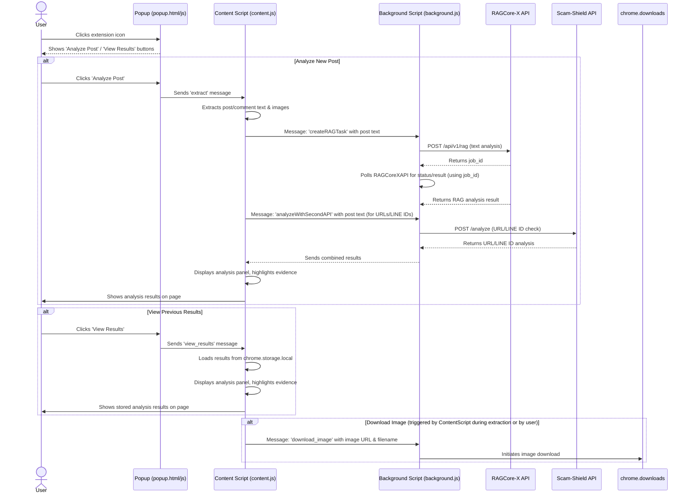

# Facebook Post Analyzer

A Chrome extension designed for Facebook that automatically analyzes post and comment content, identifies scam risks, and provides detailed intelligent analysis results.

## Authors

*   [Ken Su](https://github.com/ken22i)
*   [Jerry Hung](https://github.com/JerryHung1030)
*   [SJ](https://github.com/shih1999)

## Table of Contents

-   [✨ Features](#-features)
-   [🖼️ DEMO](#️-demo)
-   [🗺️ Architecture Overview](#️-architecture-overview)
-   [🚀 Quick Start](#-quick-start)
-   [⚙️ Usage](#️-usage)
-   [📂 Project Structure](#-project-structure)
-   [🔧 Backend API Interaction](#-backend-api-interaction)
-   [🛠️ Development](#️-development)
-   [📌 Important Notes](#-important-notes)
-   [🤝 Contributing](#-contributing)
-   [📄 License](#-license)

## ✨ Features

-   📝 **One-Click Analysis:** Automatically extracts content from Facebook posts and comments.
-   🖼️ **Image Download (Optional):** Supports batch downloading of images from posts.
-   🤖 **Intelligent Scam Detection:** Utilizes RAG (Retrieval-Augmented Generation) technology and LLMs for smart scam analysis.
-   🔍 **Evidence Highlighting (Optional):** Highlights suspicious evidence directly within the Facebook post.
-   📊 **Interactive Analysis Panel:** Displays a risk assessment (e.g., risk meter), suspicious items, and identified scam types in a right-hand sidebar.
-   📋 **Copy Results:** Allows one-click copying of the complete analysis findings.
-   🎯 **Versatile Detection:** Identifies various scam techniques (e.g., fake investments, romance scams, phishing links).
-   📈 **Confidence Scores:** Shows the AI's confidence level in its analysis.

## 🖼️ DEMO


The right-hand analysis panel shows the risk level, a button to copy analysis results, and other features.

## 🗺️ Architecture Overview

This Chrome extension interacts with the active Facebook page and two backend services to provide its analysis.



## 🚀 Quick Start

1.  **Download:** Download this project and unzip it.
2.  **Open Chrome Extensions:** Open Chrome and navigate to `chrome://extensions/`.
3.  **Enable Developer Mode:** Turn on "Developer mode" using the toggle in the top-right corner.
4.  **Load Extension:** Click "Load unpacked" and select the unzipped project folder.
5.  **Usage:** Once installed, navigate to a Facebook post page and click the extension icon in your browser toolbar to use it.

## ⚙️ Usage

1.  **Open Extension:** On a Facebook post page, click the extension icon.
2.  **Start Analysis:** Click "Analyze Post" to begin the automated analysis.
3.  **View Results:** After analysis, an interactive panel will appear on the right side of the page.
    *   You can click "Copy Analysis Results" for a quick copy.
    *   (Optional) Click highlighted text within the post to see evidence details.
4.  **Re-View Results:** Click "View Results" anytime to show the last analysis performed.

## 📂 Project Structure

```
.
├── manifest.json         // Extension configuration file
├── background.js         // Handles background tasks, API calls, downloads
├── content.js            // Main script injected into Facebook pages for analysis and UI
├── popup.html            // UI for the extension's popup window
├── popup.js              // Logic for the popup window interactions
├── mockdata.json         // Sample data for testing (development use)
├── icon.png              // Extension icon
├── README.md             // This project documentation
└── docs/
    └── demo_2025_06_24.gif // Demonstration GIF
```

## 🔧 Backend API Interaction

The extension communicates with two backend services deployed at `http://192.168.70.88` (configurable in `background.js`):

*   **RAGCore-X API (`:8000/api/v1/rag`)**:
    *   `POST /api/v1/rag`: Submits post text for semantic scam analysis.
    *   `GET /api/v1/rag/{job_id}/status`: Checks the status of an analysis job.
    *   `GET /api/v1/rag/{job_id}/result`: Retrieves the results of a completed analysis job.
*   **Scam-Shield API (`:8001/analyze`)**:
    *   `POST /analyze`: Submits text (typically the post content) to check for suspicious LINE IDs and URLs.

Authentication for the RAGCore-X API is done via a Basic Auth header (see `AUTH_HEADER` in `background.js`).

## 🛠️ Development

*   This project is a pure front-end Chrome Extension and does not require a separate build process.
*   To test with different API endpoints, modify the `API_BASE_URL` and `API_BASE_URL_2` constants in `background.js`. You can also use the `mockdata.json` for offline testing by modifying the `analyzeWithSecondAPI` function in `background.js` to return mock data.
*   Debugging is recommended using Chrome's Developer Tools (inspect popup, inspect service worker, and inspect content script in the context of a Facebook page).

## 📌 Important Notes

*   A stable internet connection is required to get real-time analysis results from the backend APIs.
*   If Facebook's interface undergoes significant changes, some DOM selectors in `content.js` might need adjustments. (Tested and functional as of June 2024).
*   Currently optimized for Chrome. Functionality on other browsers has not been fully tested.

## 📄 License

Proprietary Software License Agreement

Copyright (c) 2025 Institute for Information Industry (III), Cyber Security Technology Institute (CSTI)

All rights reserved. This software is proprietary and confidential. Unauthorized copying, modification, distribution, or use is strictly prohibited.

> © 2025 Institute for Information Industry (III), Cyber Security Technology Institute (CSTI).
